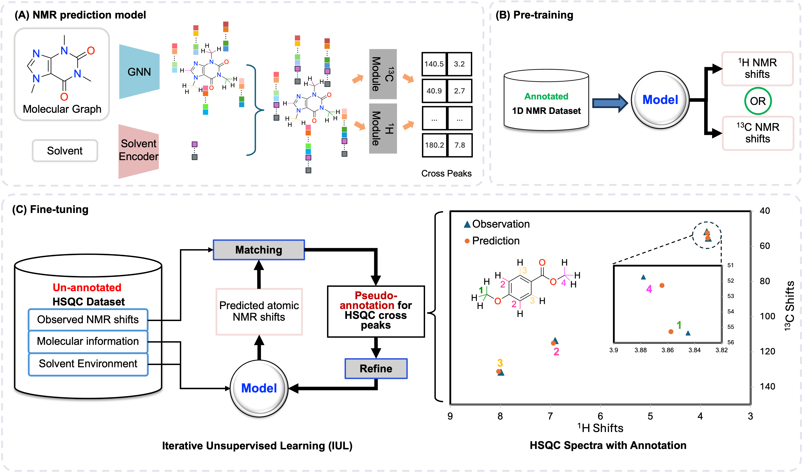

# TransPeakNet
Official code and data of paper: [TransPeakNet: Solvent-Aware 2D NMR Prediction via Multi-Task Pre-Training and Unsupervised Learning](https://www.nature.com/articles/s42004-025-01455-9)

This article is licensed under a Creative Commons Attribution-NonCommercial-NoDerivatives 4.0 International License, which permits any non-commercial use, sharing, distribution and reproduction in any medium or format, as long as you give appropriate credit to the original author(s) and the source, provide a link to the Creative Commons licence, and indicate if you modified the licensed material.

The full dataset is available upon request. The test dataset is available here: https://drive.google.com/drive/folders/1wQxk7mnIwi5aAGaF34_hk7xo6IeEh-IE?usp=drive_link




## Requirements and Installation
### 1. Create Virtual Environment
```
conda create -n nmr python=3.9 
conda activate nmr
```

### 2. Install dependencies
```
pip install torch==1.13.1+cu117 torchvision==0.14.1+cu117 torchaudio==0.13.1 --extra-index-url https://download.pytorch.org/whl/cu117
pip install torch-geometric==1.6.3 torch-sparse==0.6.9 torch-scatter==2.0.7 -f https://data.pytorch.org/whl/torch_stable.html
pip install pytorch_lightning 
pip install pandas 
pip install matplotlib
pip install numpy
pip intall pickle5
conda install -c conda-forge rdkit
pip intall argparse
```
## Usage
### Training the Model
First, do supervised training for 1D dataset, run: 
```
python main_GNN_1dnmr.py 
```
The SMILES data used for this pre-training is saved under the ```data_csv/1dnmr``` folder. The train-test split is done using seed 0 in the code.

After the pre-training step, generate pseudo-label using our matching algorithm, run:
```
python c_h_matching.py 
```
Lastly, use the pseudo-label to refine the model on 2D NMR data, run:
```
python main_GNN_2dnmr.py 
```
The SMILES data used for this pre-training is saved under the ```data_csv/2dnmr``` folder. The train-val split is also done using seed 0 in the code. The test data used to evaluate model performance is an out-of-sample dataset with expert annotation. 

Repeat step 2 and step 3 until model converges.

Our check point files are saved under ```ckpt``` folder.

### Evaluating the Model 
The evaluatiion of the model is recorded in ```evaluation.ipynb```
The expert validated test dataset can be downloaded from ```https://drive.google.com/drive/folders/1wQxk7mnIwi5aAGaF34_hk7xo6IeEh-IE?usp=drive_link```


